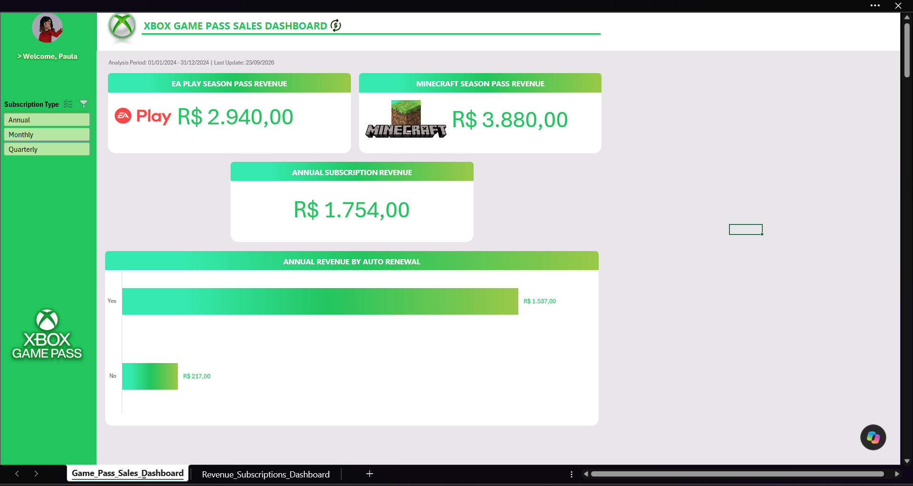
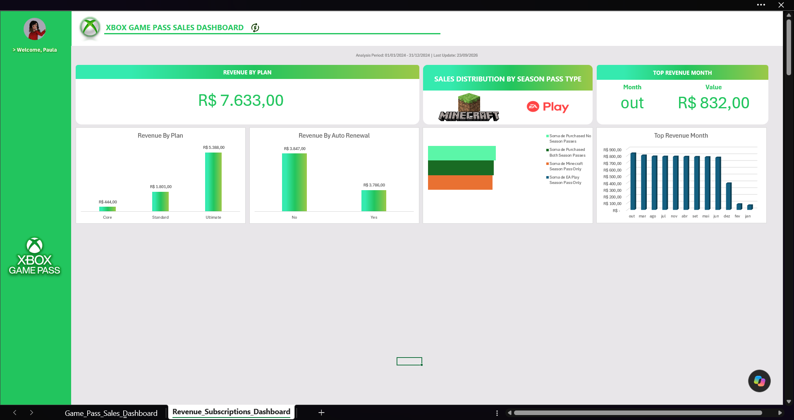

# 🎮 OMNIS — Xbox Game Pass Sales Dashboard

Dashboard de vendas do **Xbox Game Pass desenvolvido em Excel**, com foco na análise de receita, assinaturas, renovação automática e aquisição de Season Passes.

O projeto foi iniciado a partir de um desafio prático da **DIO (Digital Innovation One)** e posteriormente expandido com novas perguntas de negócio, análises adicionais e um segundo dashboard desenvolvido para aprofundar a exploração dos dados.

---

## 🎯 Objetivo do projeto

O objetivo foi transformar uma base de dados de assinaturas do Xbox Game Pass em informações visuais que permitissem acompanhar indicadores de vendas e responder perguntas de negócio.

Além das análises propostas originalmente no desafio, o projeto foi ampliado para investigar:

- faturamento por plano;
- faturamento por renovação automática;
- comportamento de compra dos Season Passes;
- período de maior faturamento;
- distribuição da receita entre diferentes categorias de assinatura.

---

## 📊 Dashboard — Xbox Game Pass Sales



O primeiro dashboard apresenta os principais indicadores relacionados às assinaturas e aos Season Passes.

### Indicadores apresentados

- receita do EA Play Season Pass;
- receita do Minecraft Season Pass;
- receita das assinaturas anuais;
- receita anual de clientes com e sem renovação automática;
- segmentação por tipo de assinatura:
  - Annual;
  - Monthly;
  - Quarterly.

Essa etapa foi construída a partir da proposta original do desafio da DIO e posteriormente personalizada visualmente.

---

## 📈 Dashboard — Revenue & Subscriptions



Após a conclusão do desafio original, uma segunda etapa de análise foi desenvolvida para explorar novas perguntas de negócio utilizando a mesma base de dados.

As novas análises foram realizadas utilizando recursos do Excel, como **Tabelas Dinâmicas, fórmulas condicionais, campos auxiliares, segmentação de dados e gráficos**.

---

## 🔎 Análises adicionais

### 💰 Receita por plano

Foi analisado o faturamento total gerado por cada plano:

| Plano | Receita |
|---|---:|
| Core | R$ 444,00 |
| Standard | R$ 1.801,00 |
| Ultimate | R$ 5.388,00 |

O plano **Ultimate** apresentou o maior faturamento da base analisada.

---

### 🔄 Receita por renovação automática

A receita também foi analisada de acordo com a opção de renovação automática:

| Renovação automática | Receita |
|---|---:|
| No | R$ 3.847,00 |
| Yes | R$ 3.786,00 |

Os dois grupos apresentam valores próximos, com pequena diferença de faturamento entre clientes com e sem renovação automática.

---

### 🎮 Distribuição dos Season Passes

Os assinantes foram classificados em quatro grupos mutuamente exclusivos:

| Comportamento de compra | Assinantes |
|---|---:|
| Somente EA Play | 0 |
| Somente Minecraft | 96 |
| Ambos os Season Passes | 98 |
| Nenhum Season Pass | 101 |

A classificação foi criada por meio de **campos auxiliares e lógica condicional**, permitindo identificar o comportamento de compra de cada assinante.

Um ponto observado na análise foi que todos os clientes que adquiriram o **EA Play Season Pass** também adquiriram o **Minecraft Season Pass** dentro da base analisada.

---

### 📅 Mês com maior faturamento

A receita foi agrupada por mês utilizando a data de início da assinatura (`Start Date`) e o valor total (`Total Value`).

O maior faturamento mensal ocorreu em:

**Outubro — R$ 832,00**

---

## 💵 Faturamento total analisado

A base apresentou faturamento total de:

### **R$ 7.633,00**

Esse valor foi utilizado como referência para as análises de receita por plano e por renovação automática.

---

## 🗂️ Estrutura da base

A base utilizada possui **295 registros de assinantes** e contém informações como:

- Subscriber ID;
- Name;
- Plan;
- Start Date;
- Auto Renewal;
- Subscription Price;
- Subscription Type;
- EA Play Season Pass;
- EA Play Season Pass Price;
- Minecraft Season Pass;
- Minecraft Season Pass Price;
- Coupon Value;
- Total Value.

Durante a expansão do projeto, também foram utilizados campos auxiliares para apoiar análises específicas de comportamento de compra.

---

## 🛠️ Recursos utilizados

O projeto foi desenvolvido no **Microsoft Excel**, utilizando principalmente:

- Tabelas Dinâmicas;
- Segmentação de Dados;
- Gráficos;
- Fórmulas condicionais;
- Função `SE`;
- Campos auxiliares;
- Agrupamento e consolidação de dados;
- Indicadores (KPIs);
- Formatação personalizada;
- organização visual de dashboards.

---

## 🧠 Perguntas de negócio

A construção das análises buscou responder perguntas como:

1. Qual plano gera maior faturamento?
2. Clientes com ou sem renovação automática geram maior receita?
3. Quantos assinantes adquiriram apenas um Season Pass, ambos ou nenhum?
4. Qual mês apresentou o maior faturamento?
5. Como a receita está distribuída entre os diferentes planos?
6. Qual é o faturamento total da base analisada?

Essas perguntas foram utilizadas para transformar os registros da base em informações úteis para análise.

---

## 💡 Principais insights

A análise permitiu observar que:

- o plano **Ultimate** concentra a maior parcela do faturamento entre os planos;
- a receita de clientes com e sem renovação automática apresenta valores próximos;
- não existem clientes que tenham adquirido somente o EA Play Season Pass na base analisada;
- **98 assinantes adquiriram os dois Season Passes**;
- **101 assinantes não adquiriram nenhum Season Pass**;
- outubro apresentou o maior faturamento mensal;
- o faturamento total da base analisada foi de **R$ 7.633,00**.

---

## ✨ Personalizações realizadas

Além da reprodução das análises propostas no desafio, o projeto recebeu diversas personalizações:

- identidade visual inspirada no Xbox Game Pass;
- reorganização dos elementos do dashboard;
- criação e padronização dos indicadores;
- inclusão de um KPI de receita anual;
- utilização de imagens e elementos visuais relacionados aos produtos;
- criação de um segundo dashboard;
- desenvolvimento de novas perguntas de negócio;
- criação de campos auxiliares para novas análises;
- novas Tabelas Dinâmicas;
- novos gráficos;
- análise temporal de faturamento;
- análise de receita por plano;
- análise de renovação automática;
- classificação do comportamento de compra dos Season Passes.

---

## 📚 Aprendizados

O projeto permitiu praticar não apenas a construção visual de dashboards, mas também o processo de transformar uma pergunta de negócio em uma análise.

Entre os principais aprendizados estão:

- estruturar indicadores de acordo com uma pergunta de negócio;
- utilizar Tabelas Dinâmicas para resumir dados;
- escolher diferentes formas de agrupar e comparar informações;
- criar regras condicionais para classificar registros;
- identificar categorias que não podem se sobrepor;
- validar resultados comparando subtotais com o total da base;
- transformar resultados analíticos em visualizações;
- diferenciar quantidade de registros, receita e outros tipos de métricas;
- revisar a consistência entre os dados, os indicadores e os títulos apresentados no dashboard.

---

## 📁 Estrutura do repositório

```text
omnis-xbox-sales-dashboard/
│
├── images/
│   ├── Game_Pass_Sales_Dashboard.png
│   └── Revenue_Subscriptions_Dashboard.png
│
├── projeto_vendas_xbox.xlsx
│
└── README.md
